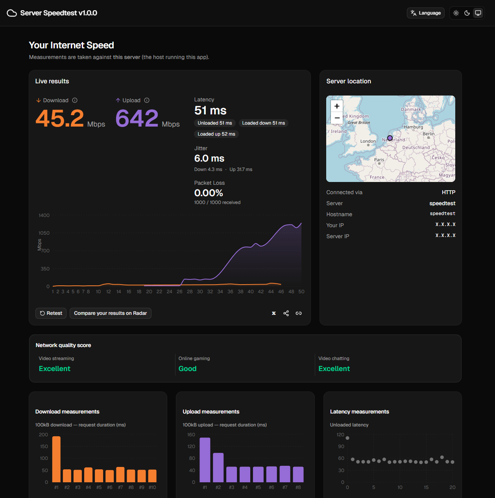

# Server Speedtest

[](LICENSE)
[](https://github.com/StateByte/server-speedtest/pkgs/container/server-speedtest)

A web app for measuring network performance **against the server that hosts it**: download, upload, latency, jitter, packet loss, and a channel quality score. Built with **Next.js** (App Router), **WebRTC** (`@roamhq/wrtc`) for load-style measurements, **HTTP** for ping/jitter, **React** + **Tailwind CSS** for the UI, and **OpenStreetMap** raster tiles for the location map. **English** and **Russian** locales.

## Screenshot

<p align="center">
  
</p>

## Features

- **Download / upload** over a WebRTC data channel with a real-time chart  
- **Latency**, **jitter**, and **packet loss**  
- **Network Quality Score** and session summary  
- **Server vs. you** map (great-circle path; the UI explains the straight map segment) with **pan**, **zoom** (+/−, wheel, pinch), **fit reset**, and smooth motion  
- Dark/light theme and language switcher  

## Quick start (development)

Requires **Node.js 22+** (same major as the Docker image) and npm.

```bash
npm ci
npm run dev
```

Open [http://localhost:3000](http://localhost:3000).

Production build and run:

```bash
npm run build
npm start
```

Lint:

```bash
npm run lint
```

## Docker

The default Compose file pulls a **public image** from GitHub Container Registry:

`ghcr.io/statebyte/server-speedtest:latest`

Run (HTTP on the port from `.env` or **3000**, UDP **10000–10099** for ICE, as in [`docker-compose.yaml`](docker-compose.yaml)):

```bash
docker compose pull
docker compose up -d
```

To build the image locally instead, uncomment `build: .` and comment or remove the `image:` line in `docker-compose.yaml`, then run `docker compose up --build`.

Optionally set `HOST_PORT` in `.env` and align **`WRTC_ICE_UDP_PORT_MIN`** / **`WRTC_ICE_UDP_PORT_MAX`** with your published UDP range on the host and in Compose.

### Container registry (CI)

Pushing to `main`, pushing a semver tag `v*.*.*`, or running the workflow manually triggers [`.github/workflows/docker-publish.yml`](.github/workflows/docker-publish.yml), which builds and pushes the image to **GHCR** (`ghcr.io/statebyte/server-speedtest`). Tagged releases also receive the `latest` tag.

## API layout (overview)

Routes under `src/app/api/` power the measurements (including `webrtc/offer`, `download`, `upload`, `ping`, `server-info`, and others)—see the repository code for details.

## License

[MIT](LICENSE)

## Star History

[](https://star-history.com/#StateByte/server-speedtest&Date)

Author in `package.json`: **@statebyte**.
